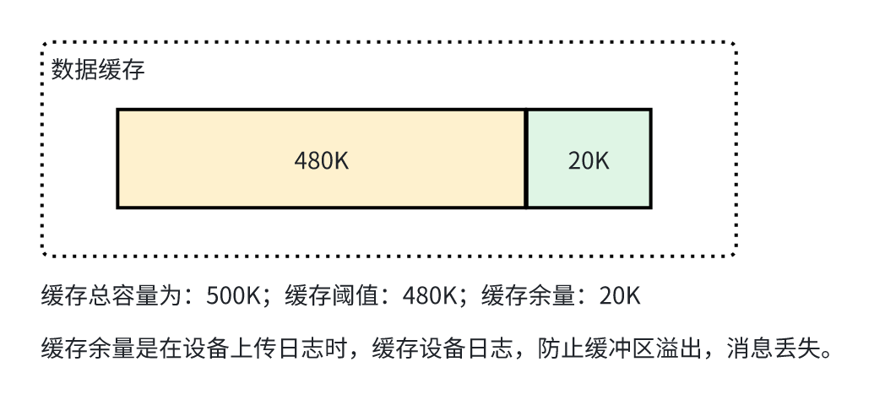
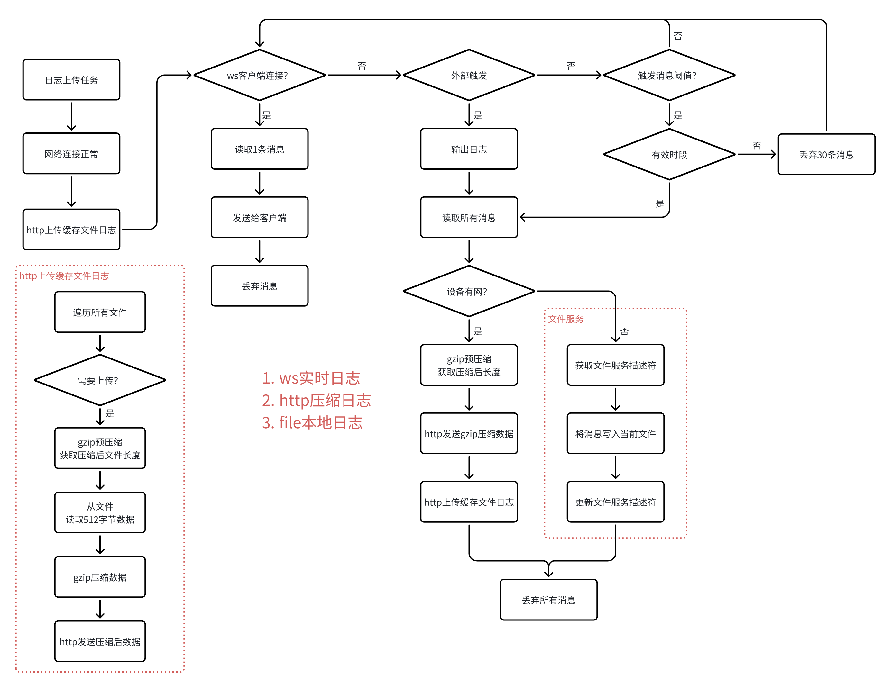

# 组件说明

日志服务，支持：ws实时日志、http压缩日志、file本地日志

1. ws实时日志：仅支持一个客户端连接，新客户端连接后，旧客户端被断开连接。

2. http压缩日志：通过http form方式提交日志，提交gzip压缩日志，上传成功，提供response处理回调。

3. file本地日志：设备网络异常时，通过本地日志缓存文件。最大缓存数量为5个，缓存满，旧文件被覆盖。

# 组件依赖

依赖于：rb_log、gzip_deflate

1. rb_log：提供日志缓存服务。

2. gzip_deflate：提供gzip流式压缩服务。

# 日志缓存

# 日志服务框图

